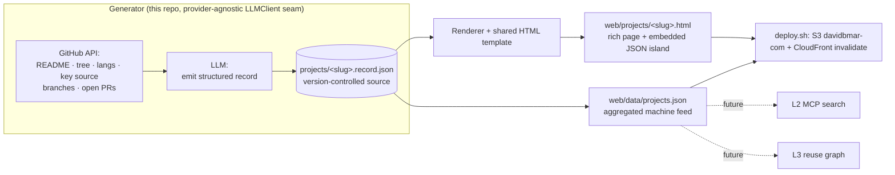
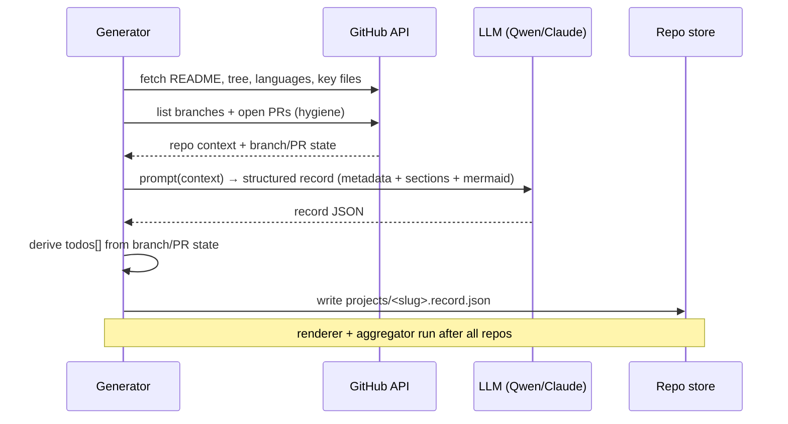

# L0 — AI-Generated Project Docs (Self-Documenting Portfolio) — Design

**Date:** 2026-06-13
**Status:** Approved design, pre-implementation
**Repo:** `github-portfolio-search` (deploys to davidbmar.com via S3 + CloudFront)
**Scope:** L0 only — generate one rich, browser-rendered, machine-readable doc per repo. L1/L2/L3 (below) are explicitly out of scope but the design leaves seams for them.

---

## North star (why this exists)

> A living knowledge base where **every project documents itself** — AI-written, human-readable — **publishes to davidbmar.com**, and feeds a graph that lets AI **find and reuse what we've already built instead of rebuilding it.**

This is a *dual-audience* system from the start:

- **For humans** — beautiful, genuinely readable project pages: *what it is · a UI screenshot · a feature overview · a quickstart · how it's built (with diagrams) · how to apply & reuse it.* The screenshot is generator-derived from the repo's README (first non-badge image, relative paths resolved to raw.githubusercontent.com); the quickstart and feature overview are LLM-authored.
- **For AI** — a discoverable corpus of every project, so an agent (Claude Code, a future you, a collaborator) can ask *"have we built this before?"* and find it. The AI both **writes** these docs and **consumes** them.

### The full stack (context — only L0 is in scope here)

```
L3  GRAPH / REUSE    nodes: projects · components · patterns
                     edges: depends-on · similar · reuses
                     AI asks "what can I reuse for X?"            ← the dream
L2  AI DISCOVERY     corpus + MCP: "have we built this?"          ← ~half exists (MCP ships)
L1  HUMAN SITE       readable brief pages on davidbmar.com        ← deploy pipeline exists
L0  STRUCTURED DOCS  AI-generated, per-repo, rich HTML +          ← THE KEYSTONE (this spec)
                     embedded machine-readable metadata
```

**L0 is the keystone — every layer above it is starved without it.** Today a "repo" is a
name + a README blob + an embedding; you cannot build a reuse edge like *"reuses the
LLMClient seam"* or *"implements OAuth"* from that. The quality of L3 is decided at L0: if
the generated doc emits *typed* facts, the graph's nodes and edges practically fall out.
Each layer also ships value alone — L0 already gives the always-updated, human-readable,
AI-readable pages we want.

---

## Problem

`davidbmar.com` (this repo) is entirely **repo-driven and auto-extracted**: an indexer reads
each repo's README + metadata, generates embeddings, and renders search / clusters / a thin
per-repo detail page. That is good for *finding* repos but weak for *understanding and
reusing* them — there is no curated explanation of what a project is, how it's built, or how
to lift pieces of it into the next project. We want a **richer, AI-generated doc per repo**,
rendered as a real web page (good visuals, diagrams **and sequence diagrams**), that is also
**machine-readable** so later layers (MCP search, reuse graph) can consume it.

---

## Decisions (locked)

| Decision | Choice | Rationale |
|----------|--------|-----------|
| Output format | **Rich HTML page** per repo (renders in browser, Mermaid diagrams) | Humans want visuals + diagrams, not a markdown dump |
| Source representation | **Structured record** (typed metadata + section content + Mermaid specs), rendered by a shared template | Consistency at 137 repos + reliable machine-readability; see "Template vs raw HTML" below |
| Machine-readability | Structured record **embedded in each page** (JSON island + JSON-LD) **and** aggregated to `web/data/projects.json` | One generation pass, two consumers — the feed for L2/L3 |
| Where docs live (v1) | **Generated & stored centrally** in this repo (Approach B) | Zero blast radius on 137 repos; fastest to a real page; commit-back is additive later |
| Repo coverage | **All repos** (~137), incl. forks/archived/stubs | User intent; thin repos are *marked*, not skipped (see `thin`) |
| LLM provider | **Provider-agnostic** seam; reuse the existing Alibaba Qwen (DashScope) key for v1 | Proven key; model becomes a cost/quality dial, not a commitment |
| Diagrams | **Mermaid** — one architecture (`flowchart`) + one `sequenceDiagram` per project | AI writes diagrams as text; rendered client-side; diffable & regenerable |
| Repo hygiene | Each page carries a **"Needs attention" TODO panel** (unmerged branches, open PRs, work not on `main`) | Captured free during generation; doubles the hub as a cleanup dashboard |
| Publishing | Reuse existing `deploy.sh` (S3 `davidbmar-com` + CloudFront invalidation) | No new pipeline |

### Template vs raw HTML (the one real fork — resolved: **template**)

**Template-renders-structured-data beats AI-writes-raw-HTML at this scale.** If the LLM
emitted freeform HTML for 137 repos we'd get 137 inconsistent layouts, broken-markup risk,
and no reliable way to extract machine-readable facts. By having the AI fill a *structured
record* and a fixed template produce the HTML, every page looks deliberate, diagrams render
uniformly, and the same fields that draw the page feed the graph. Bespoke-quality visuals
without bespoke-per-page maintenance.

---

## Architecture



The generation flow, per repo:



### The artifact — one source, two readers

Per repo, the generator emits a **structured record** (`projects/<slug>.record.json`). The
renderer turns it into a rich HTML page; the aggregator rolls all records into
`web/data/projects.json`. **One file, two readers** — generate once, serve humans and
machines from the same data.

Record schema (v1):

```jsonc
{
  "slug": "generate-title-headline-hooks",
  "title": "Headline Generator",
  "repo_url": "https://github.com/davidbmar/generate_title_headline_hooks",
  "visibility": "private",          // public | private
  "status": "shipped",              // idea | building | shipped
  "thin": false,                    // fork/empty/stub → true (protects the future graph)
  "one_liner": "Integrity-checked headline generation from a story.",

  // --- human sections (prose; rendered to HTML) ---
  "what_it_is": "…",
  "how_its_built": "…",
  "how_to_apply": "…",
  "quickstart": "pip install … && … run",   // how to get running quickly (LLM)
  "features": ["fast search", "static deploy"], // human-facing overview (LLM)
  "screenshot_url": "https://raw.githubusercontent.com/…/shot.png", // UI photo (generator-derived from README; "" if none)

  // --- diagrams (Mermaid source; rendered client-side) ---
  "diagram_architecture": "flowchart LR; …",
  "diagram_sequence": "sequenceDiagram; …",

  // --- typed metadata (machine; feeds L2/L3) ---
  "capabilities": ["headline generation", "fact-integrity checking"],
  "components":   ["LLMClient seam", "HeuristicScorer", "integrity gate"],
  "tech":         ["python", "fastapi", "sqlite"],
  "depends_on":   ["anthropic", "httpx"],
  "integrates_with": ["Alibaba Qwen (DashScope)", "Ollama", "MLX"],
  "patterns":     ["provider-adapter", "fail-closed gate", "scorer protocol"],
  "reuse_tags":   ["llm-provider-isolation", "json-mode-client", "ast-import-test"],

  // --- repo hygiene (derived from GitHub API) ---
  "todos": [
    { "kind": "unmerged_branch", "detail": "feat/x is 3 commits ahead of main" }
  ],

  // --- provenance ---
  "generated_at": "2026-06-13T00:00:00Z",
  "source_commit": "abc1234",
  "model": "qwen3.7-plus"
}
```

In each rendered page the record is embedded as a JSON data island
(`<script type="application/json" id="project-data">`) plus a JSON-LD `SoftwareSourceCode`
block for SEO. **Machine-readability falls out for free.**

### Generator (provider-agnostic)

A Python tool in this repo iterates all repos via the GitHub API, builds per-repo context,
and calls an LLM through a small **`LLMClient` seam** — the same pattern proven in
`generate_title_headline_hooks` (a `DashScopeClient` for Qwen, an `AnthropicClient` for
Claude). **The model choice becomes a cost/quality dial, not a commitment:** generate cheaply
on Qwen for thin/fork repos, escalate flagship repos to Claude, per-repo, with no code change.

Keys: `github-portfolio-search` is **public**, so the LLM key is never committed — it lives
as a **GitHub Actions secret** (`DASHSCOPE_API_KEY`, `DASHSCOPE_BASE_URL`, `DASHSCOPE_MODEL`)
for the Action and in a gitignored `.env` for local runs. Reuse the existing
`alibaba-headline-gen` key for v1; a dedicated key later buys isolated billing/limits and
one-switch revocation of the batch.

### Diagrams — and why sequence diagrams specifically

Every project gets a `flowchart` (architecture) **and** a `sequenceDiagram` (how it actually
runs), authored by the LLM as Mermaid text and rendered client-side by `mermaid.js`.
**Sequence diagrams force the AI to actually understand the code** — a flowchart can be
hand-waved from a README, but a correct `sequenceDiagram` requires tracing who-calls-what.
Requiring one per project raises the floor on doc quality and produces exactly the artifact
that makes "how is this built" reusable to a future you or an AI agent.

### Repo hygiene TODO

During generation the tool already hits each repo's GitHub API; branch and open-PR state come
from the **same calls**, so it derives a `todos[]` block (branches ahead of the default
branch, open PRs, work not landed on `main`). The page shows a **"Needs attention"** panel,
or **"✓ all on main"** when clean. **This is nearly free here and impossible-cheap later** —
without it, surfacing "what's not on main across 137 repos" would need a second full sweep.
*Limitation:* the GitHub API sees branches/PRs but **not local uncommitted state**; local
dirtiness is out of scope for v1 (would require cloning every repo).

### All repos, honestly — the `thin` flag

Forks, archived repos, and empty stubs still get an entry, but the generator **marks them**
(`thin: true`, minimal token spend) rather than hallucinating depth. **`thin` protects L3:**
if every fork and stub got a confident-sounding brief, the future reuse graph would fill with
phantom capabilities and garbage edges. Marking thin repos at generation time lets the graph
later weight or hide them — a one-field decision now that prevents downstream rot.

---

## Components (each independently testable)

| Unit | Responsibility | Depends on |
|------|----------------|-----------|
| `repo_fetch` | Pull README, tree, languages, key source, branch/PR state for one repo | GitHub API |
| `llm_client` | `complete_json(system, user)` seam; DashScope + Anthropic adapters | provider key |
| `record_gen` | Prompt → validated structured record (schema-checked, retried) | `llm_client`, schema |
| `hygiene` | Derive `todos[]` from branch/PR state | `repo_fetch` output |
| `render` | record → HTML page (template + Mermaid + embedded JSON island) | template, records |
| `aggregate` | All records → `web/data/projects.json` | records |
| `cli`/Action | Orchestrate over all repos; idempotent; `--only <slug>` for one | all of the above |

---

## Testing

- **Schema validation** — every generated record validates against the v1 schema; malformed
  LLM output triggers a retry, then a marked failure (never a broken page).
- **Determinism where possible** — `render`, `aggregate`, and `hygiene` are pure functions
  over a record/API-response fixture; unit-tested without network or LLM.
- **Golden render** — a fixture record renders to expected HTML structure (page has the JSON
  island, both Mermaid blocks, the hygiene panel).
- **Guinea pig** — first real generation target is `generate_title_headline_hooks`; its page
  must read true (its hygiene panel should show **"✓ all on main"**) before any batch run.

---

## Explicitly out of scope (future layers)

- **Commit-back of docs into each repo** (Approach A) and **per-repo push-time refresh**
  (Approach C) — the record/schema is designed so both are additive, no rework.
- **L2** — wiring `projects.json` into the existing MCP server / search index.
- **L3** — building the reuse graph (nodes/edges) from records; possibly dogfooding the
  `ibt-ufo` knowledge-graph engine.
- Local uncommitted-state detection (needs cloning every repo).

---

## Success criteria

1. Running the generator produces a validated record + rendered HTML page for **every** repo.
2. Each page renders in the browser with readable sections and **both** a working architecture
   diagram and a working sequence diagram.
3. Each page embeds machine-readable metadata, and `web/data/projects.json` aggregates all
   records.
4. Each page shows an accurate repo-hygiene panel.
5. The `generate_title_headline_hooks` page is correct end-to-end and deployed to davidbmar.com.
